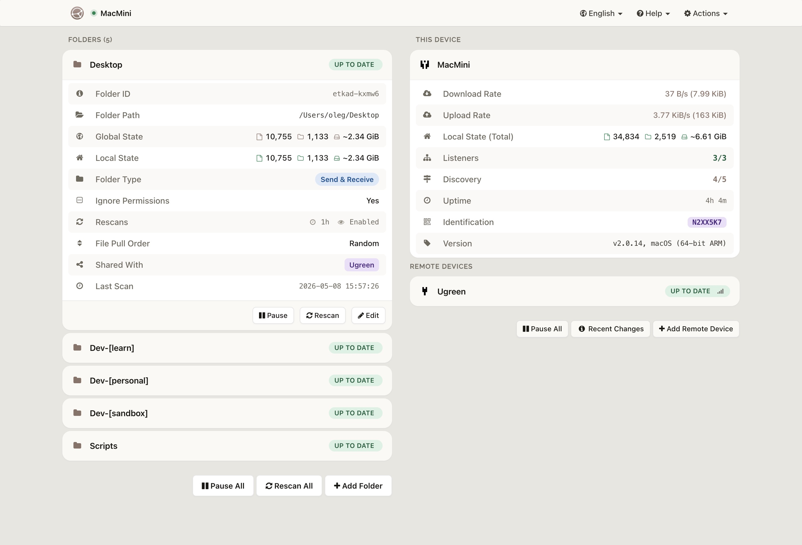
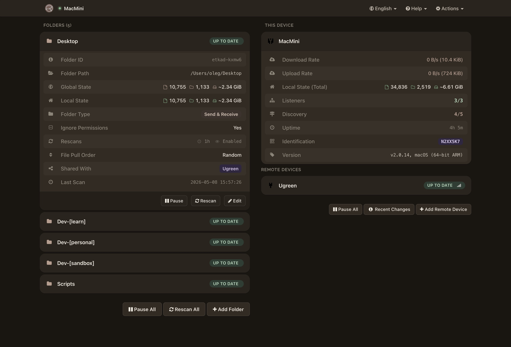

# Syncthing Vellum

Two warm, paper-inspired themes for the [Syncthing](https://syncthing.net) web GUI.

- **Vellum Light** — soft, off-white parchment with mocha accents.
- **Vellum Dark** — aged parchment by candlelight; deep warm coffee surfaces with a bronze undertone.

Both themes share the same colour system, layout tweaks, and a custom Vellum logo.

## Screenshots

> _Add `screenshots/light.jpg` and `screenshots/dark.jpg` and they will render below._

| Light | Dark |
| --- | --- |
|  |  |

## Install

Syncthing loads custom themes from the `gui/` folder inside its config directory.

**1. Find your Syncthing config directory**

| OS | Path |
| --- | --- |
| macOS | `~/Library/Application Support/Syncthing` |
| Linux | `~/.local/state/syncthing` (or `~/.config/syncthing` on older versions) |
| Windows | `%LOCALAPPDATA%\Syncthing` |

**2. Copy the theme folder(s) into `gui/`**

```sh
# macOS / Linux — pick one or both
git clone https://github.com/pelinoleg/syncthing-vellum.git
cp -R syncthing-vellum/vellum-light  "$HOME/Library/Application Support/Syncthing/gui/"
cp -R syncthing-vellum/vellum-dark   "$HOME/Library/Application Support/Syncthing/gui/"
```

The final layout should look like:

```
<config>/gui/
├── vellum-light/assets/...
└── vellum-dark/assets/...
```

**3. Activate the theme**

1. Open the Syncthing web UI.
2. **Actions → Settings → GUI**.
3. **Theme** dropdown → select `vellum-light` or `vellum-dark`.
4. **Save**, then reload the page.

## Update

```sh
cd syncthing-vellum
git pull
cp -R vellum-light vellum-dark "$HOME/Library/Application Support/Syncthing/gui/"
```

## Uninstall

Switch the theme back to **Default** in Settings → GUI, then delete the theme folder from `<config>/gui/`.

## Structure

```
vellum-{light,dark}/
└── assets/
    ├── css/theme.css           # the override stylesheet
    └── img/logo-horizontal.svg # custom Vellum logo
```

Each theme is a single CSS file plus the logo — no build step, nothing to compile.

## Compatibility

Tested on Syncthing v1.27+. The themes only override CSS and a logo asset, so they should be safe to keep across upgrades; if Syncthing changes class names in a future release, open an issue.

## Contributing

Issues and PRs welcome. If you tweak colours, please keep the warm-paper palette intact so the two themes stay siblings.

## License

[MIT](LICENSE)
